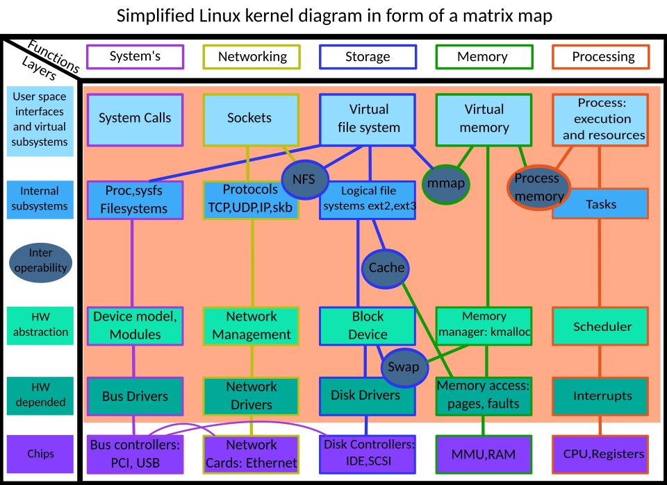

# Kernel Module Drivers :computer:



*Image source: [Linux kernel diagram.svg](https://commons.wikimedia.org/wiki/File:Linux_kernel_diagram.svg)*

This repository contains Linux kernel module drivers for various hardware interfaces. For setting up the complete QEMU and Linux development environment, please visit our companion project:
[qemu_mbr_boot](https://github.com/space-scl/qemu_mbr_boot) :arrow_upper_right:

---

## :floppy_disk: Featured Drivers

| Category          | Description                          | Key Features                     |
|-------------------|--------------------------------------|----------------------------------|
| **I2C**          | Inter-Integrated Circuit driver      | Multi-master support, SMBus compatible |
| **UART**         | Serial port driver                   | RS-232/485 support, flow control |
| **SPI**          | Serial Peripheral Interface          | Full-duplex, mode 0-3 support    |
| **GPIO**         | General Purpose I/O                  | IRQ support, sysfs interface     |
| **Misc Driver**  | Miscellaneous devices                | Flexible minor number allocation |
| **Platform Bus** | Platform device framework            | Automatic device discovery       |
| **Device Tree**  | Hardware description support         | OF API integration               |
| **Input/Output** | Character/Block device drivers       | File operations implementation   |
| **Interrupt**    | Interrupt handling                   | Top/bottom half implementation   |

---

## :wrench: Development Setup

```bash
# Clone with submodules
git clone --recurse-submodules https://github.com/space-scl/kernel-modules.git
cd kernel-modules

# Build all modules
make all

# Load specific module
sudo insmod drivers/i2c/i2c-device.ko

# Check kernel messages
dmesg | tail -20

